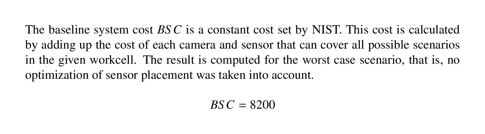
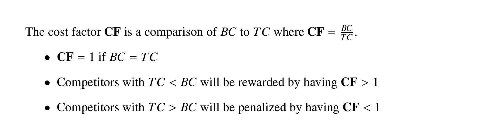
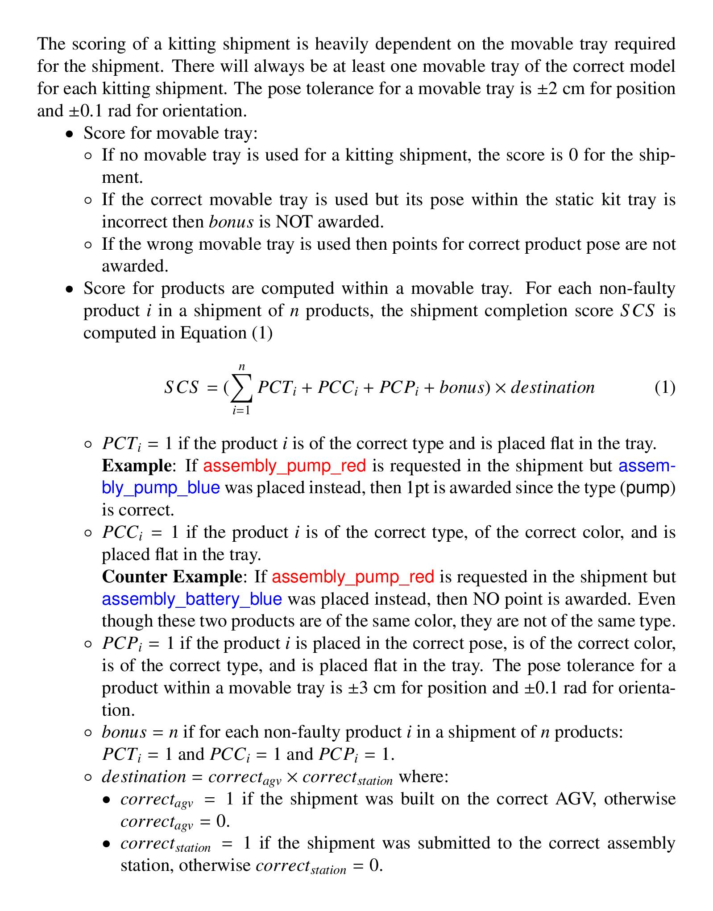
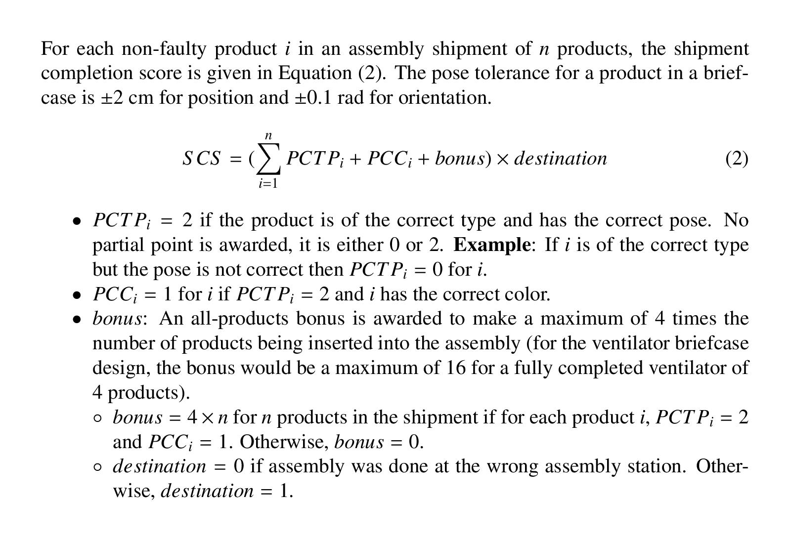
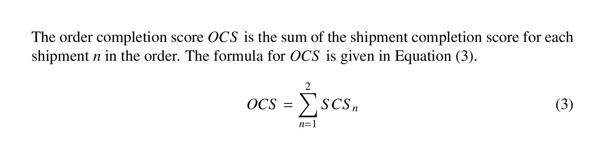
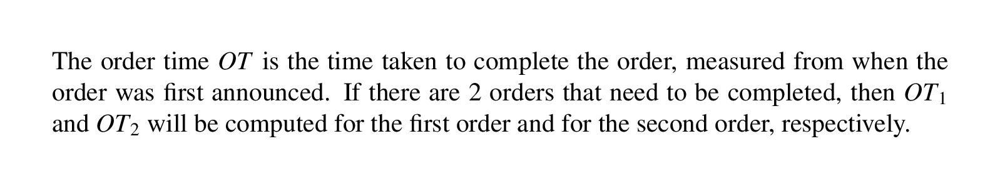
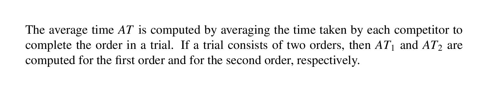
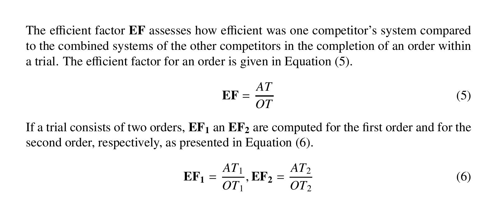
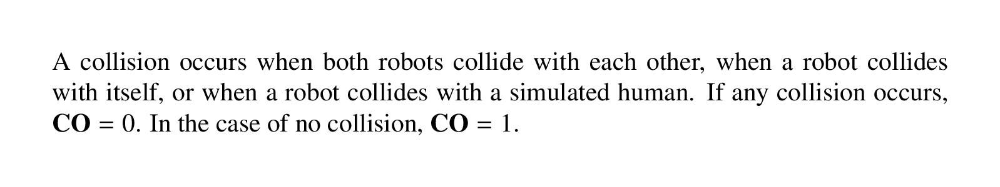
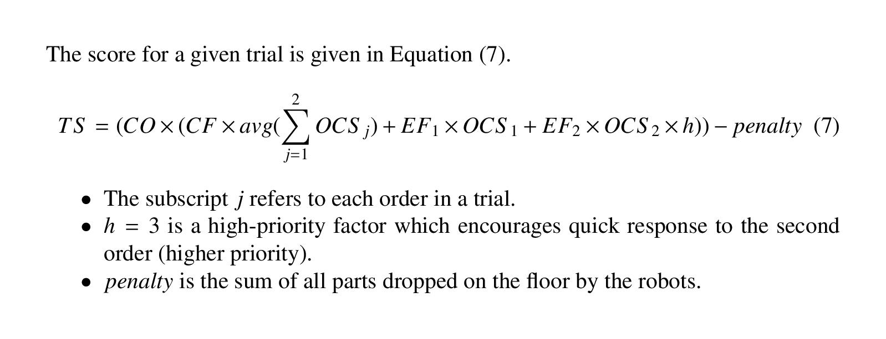

Wiki | [Home](../../README.md) | [Documentation](../documentation/documentation.md) | [Tutorials](../tutorials/tutorials.md) | [Qualifiers](../qualifiers/qualifier.md) | [Finals](../finals/finals.md)

-------------------------------------------------

- [Wiki | Documentation | Scoring](#wiki--documentation--scoring)
  - [Stability](#stability)
  - [Cost metrics](#cost-metrics)
    - [Team System Cost (TC)](#team-system-cost-tc)
    - [Baseline System Cost (BSC)](#baseline-system-cost-bsc)
    - [Cost Factor (**CF)**](#cost-factor-cf)
  - [Performance metrics](#performance-metrics)
    - [Shipment Completion Score (SCS)](#shipment-completion-score-scs)
      - [Kitting](#kitting)
      - [Assembly](#assembly)
    - [Order Completion Score (OCS)](#order-completion-score-ocs)
    - [Order Time (OT)](#order-time-ot)
    - [Average Time (AT)](#average-time-at)
    - [Efficiency Factor (**EF**)](#efficiency-factor-ef)
    - [Collision (collision)](#collision-collision)
  - [Trial Score (**TS**)](#trial-score-ts)

# Wiki | Documentation | Scoring

- Scores will be made up of:
  1. An automatically calculated component.
  2. A score based on judges.
- The automatically calculated component for each trial is a combination of cost and performance metrics.
- A team's final score will be calculated as the sum of scores for each of the competition trials.
- See [challenge.gov](https://www.challenge.gov/challenge/ariac/) for details on the judges' scoring (scroll to Judging Criteria).
- **Note** that only automated metrics will be used during the qualification rounds of the competition (no judges' scoring).

## Stability

- As outlined in the [update policy](update_policy.md), changes to the scoring metrics may be made between rounds of the competition at the discretion of the competition controllers.
- Qualifying teams will be made aware of the final scoring parameters in advance of the Finals of the competition.

## Cost metrics

- The cost metrics are calculated from a team's system setup.
- Since the same system setup is used for **all trials**, this value is constant for a competitor for all trials.
- The value in **bold** is used in the final score calculation.

### Team System Cost (TC)

- Cost of a competitor's system (sum of the cost of sensors used).
  - $300 Gantry camera (RGBD) showing gantry tray.
  - $600 Gantry camera (RGBD) showing the bins.
  - $500 for each logical camera used.
  - $300 for each RGBD camera used.
  - $200 for each depth camera used.
  - $100 for each other sensor used (breakbeam, proximity, etc).
  
### Baseline System Cost (BSC)

### Cost Factor (**CF)**

## Performance metrics

- Performance metrics cover both *completion* and *efficiency* and they are calculated for each trial separately.
  - *Completion* captures the quality of the shipments submitted.
  - *Efficiency* captures the responsiveness in fulfilling orders.
- There are up to two orders requested during each trial, each composed of up to two shipments.
- The following values are calculated for each order requested in a trial.
- The values in **bold** will be used in the final score calculation for a trial.

<!-- **Note** that products must be placed onto the base of the shipping box to count for scoring, not on top of other products. -->
### Shipment Completion Score (SCS)

#### Kitting

#### Assembly

### Order Completion Score (OCS)

### Order Time (OT)

### Average Time (AT)

### Efficiency Factor (**EF**)

### Collision (collision)

## Trial Score (**TS**)

-------------------------------------------------

Wiki | [Home](../../README.md) | [Documentation](../documentation/documentation.md) | [Tutorials](../tutorials/tutorials.md) | [Qualifiers](../qualifiers/qualifier.md) | [Finals](../finals/finals.md)
